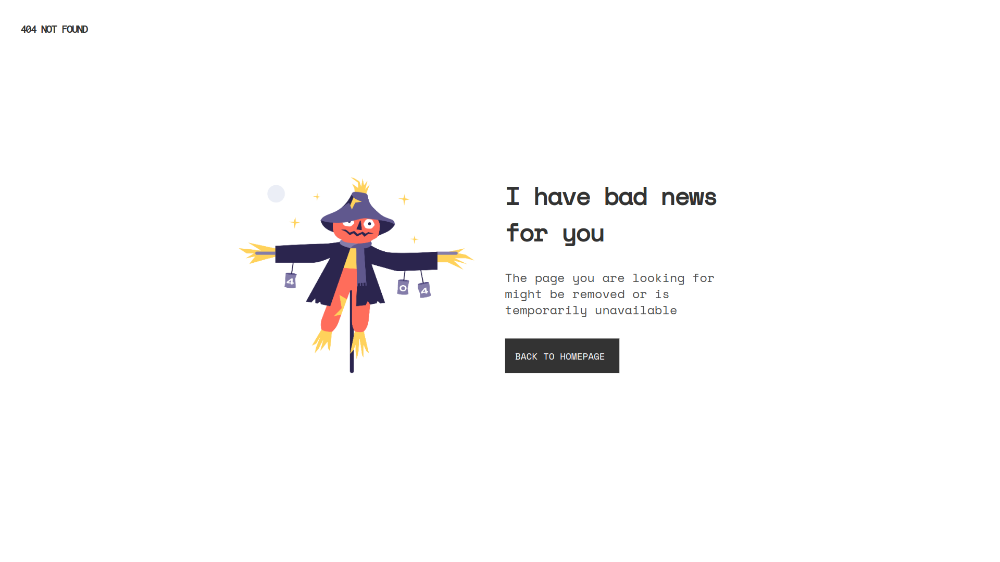

# 404 Not Found

## Overview

This site was created as a submission to a [DevChallenges](https://devchallenges.io/challenges) challenge. The [challenge](https://devchallenges.io/challenges/wBunSb7FPrIepJZAg0sY) was to build a site following the given [design](https://www.figma.com/file/QeKWLNhB13zDjJzqR22TKE).



## Live Demo

https://lugp-not-found.netlify.app/

## Tech Stack

- [Astro](https://astro.build/)
- [Tailwind CSS](https://tailwindcss.com/)

## Usage

### Installation

Clone the repository with git

```bash
    git clone https://github.com/LugpDev2022/not-found.git
```

Install the dependencies using yarn

```bash
    cd not-found
    yarn
```

### Start development server

Run the app

```bash
    yarn dev
```

### Build for production

```bash
    yarn build
```
